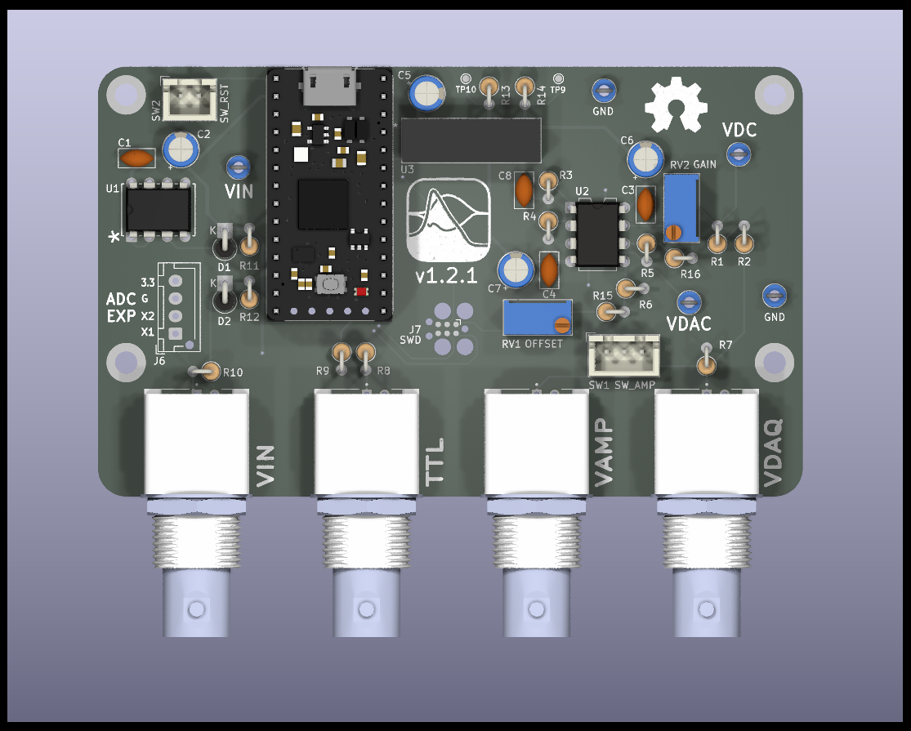

# Open Dynamic Clamp 1.2 Hardware

This documentation describes circuit schematics for the ODC 1.2 hardware iteration.
This design is based on the work of Aditya Asopa's updated schematic.

This hardware design is licensed under [CC BY 4.0](https://creativecommons.org/licenses/by/4.0/).

- Table of Contents
  - [User Guide](#user-guide)
  - [PCB Assembly Notes](#pcb-assembly-notes)
  - [Calibration Notes](#calibration-notes)
  - [Firmware Notes](#firmware-notes)

# User Guide

The design may be built successfully on a breadboard or ordered as a PCB.

- [KiCad Project](./odc-1.2)
  - [Schematic](./odc-1.2/pdf/odc-1.2.pdf)
  - [BOM](./odc-1.2/bom/odc-1.2-bom.csv)
  - [Fabrication](./odc-1.2/gerber/README.md)
- The design has been created with 100x amplification in mind
- Choose resistors with a low tolerance to avoid calibration problems (the BOM specifies high quality resistors)
  - 0.1% resistors are highly recommended but 1% resistors may be acceptable with calibration.
  - [DigiKey importable cart CSV](odc-1.2/bom/odc-1.2-digikey-cart.csv) is available with all components pre-configured.
- Double check connections before powering the circuit from the ItsyBitsy M4 module.
  - A short circuit has the risk of burning out the microcontroller module's on-board regulator.
  - Testing with the ItsyBitsy board connected by jumper wires is encouraged.
- The ADC EXP expansion port is NOT protected from over-voltage. The ItsyBitsy M4 will be damaged by voltages outside the 0-3.3V range.
- The trim potentiometers should be tuned during calibration.
- If mounting in a 3d printed enclosure the two switches should be extended from the PCB with short wire leads. These extension wires may be soldered directly to the pcb or made detachable using JST XH connectors.

# PCB Assembly Notes

An [interactive BOM](odc-1.2/bom/ibom.html) is available to help with assembly.

- Take careful note of capacitor polarity. 
  - Capacitor C7 is on a negative rail.
- The PCB has a large ground plane that soaks up heat making soldering ground connections tricky.
  - For each component solder the signal or power connection first to hold it in place before carefully soldering the ground.
  - Use plenty of flux. This will significantly improve the solders ability to flow.
    - ChipQuick No-Clean Tack Flux Syringe is highly recommended.
  - Use caution around sensitive components or plastic connectors that might melt.
- Diodes with a "K" on the board are "cathode up" which means the body of the diode lines up with the circular outline and the white stripe is pointing up.
- Use of standard height headers/pins are assumed for the Adafruit ItsyBitsy M4.
  - If you use different height headers the board may not line up with the enclosure opening
  - The 5 bottom middle pins of the ItsyBitsy M4 are only required if using SWD debugging.
- The external reset switch (SW2) is optional. The reset button on the ItsyBitsy M4 board serves the same function.
- The selector switch footprint (SW1) fits any SPDT switch or header with a 2.54mm lead spacing.
- The named test points do not need to be populated but are a convenience for clipping oscilloscope leads calibration/validation.

# Calibration Notes

A validation and calibration process is described in the [Setup Manual](../../../Setup%20and%20Calibration%20Manual%20for%20ver2.0/Setup%20Manual.pdf) by Aditya Asopa.

- Trim potentiometers for `RV1` and `RV2` will aid in setting the gain and offset. There are 2 options.
  1. You may adjust them to produce a symmetrical +/- 3.3V at `VAMP` using [this arduino sketch](./scripts/trim-gain-and-offset/trim-gain-and-offset.ino) and an oscilloscope (Must have `VDAQ` at 0V).
  2. You may adjust them to produce the exact same output as described in validation Table 2 (page 13) and Table 3 (page 15).
- To provide the required `5V` and `3.3V` power rails during initial validation you may:
  - provide the correct voltages to the correct header pins with the ItsyBitsy completely removed.
  - Power the ItsyBitsy with a USB cable and connect the `USB`, `3V` and `G` pins to the PCB headers with extension jumpers such that all other pins remain disconnected.
  - Power the ItsyBitsy with a USB cable and socket it into the PCB headers but double-click the reset button to put it into programming mode (this prevents any output voltage on the DAC pin due to any currently loaded firmware). You will see the red LED next to the reset button pulse slowly.
- Calibration to derive the slope and intercept values in table 13 (page 31) required by the firmware may be done by any of the described methods (Direct page 20, Model Cell + Processing page 23, Model Cell + Arduino page 29)
  - If you have hardware conforming to the 1.2.1 design then these precalculated values should work
    - input slope: `0.0498`
    - input intercept: `-100.875`
    - output slope: `-1.561`
    - output intercept: `2108.4`

# Firmware Notes

This hardware revision is 100% compatible with the [dynamic_clamp](../../../dynamic_clamp) Arduino firmware.

Adafruit provides an extensive Arduino setup guide which is a prerequisite for loading the firmware.
1. [Setup the Arduino IDE](https://learn.adafruit.com/introducing-adafruit-itsybitsy-m4/setup)
2. [Install Adafruit board support](https://learn.adafruit.com/introducing-adafruit-itsybitsy-m4/using-with-arduino-ide)

Additional useful information on the ItsyBitsy M4 board:
- [General board overview](https://learn.adafruit.com/introducing-adafruit-itsybitsy-m4/overview)
- [Board pin descriptions](https://learn.adafruit.com/introducing-adafruit-itsybitsy-m4/pinouts)
